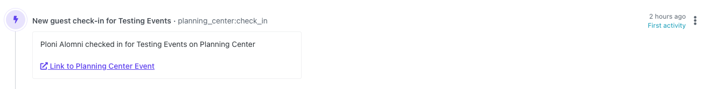

# Planning Center to Orbit Workspace Ruby App


[](https://badge.fury.io/rb/planningcenter_orbit)
[](code_of_conduct.md)

Add your Planning Center interactions into your Orbit workspace with this community-built integration.



|<p align="left">:sparkles:</p> This is a *community project*. The Orbit team does its best to maintain it and keep it up to date with any recent API changes.<br/><br/>We welcome community contributions to make sure that it stays current. <p align="right">:sparkles:</p>|
|-----------------------------------------|


## First Time Setup

To set up this integration you will need your Planning Center API secret and your Planning Center app ID. See the below table for instructions on where to find them, along with your Orbit API credentials.
## Application Credentials

The application requires the following environment variables:

| Variable | Description | More Info
|---|---|--|
| `PLANNING_CENTER_APP_ID` | Planning Center App ID | Create a new "Personal Access Token" in the [Planning Center Developer Dashboard](https://api.planningcenteronline.com/oauth/applications), your Application ID will be shown after creating it.
| `PLANNING_CENTER_API_SECRET` | Planning Center API secret | Create a new "Personal Access Token" in the [Planning Center Developer Dashboard](https://api.planningcenteronline.com/oauth/applications), your API secret will be shown after creating it.
| `ORBIT_API_KEY` | API key for Orbit | Found in `Account Settings` in your Orbit workspace
| `ORBIT_WORKSPACE_ID` | ID for your Orbit workspace | Last part of the Orbit workspace URL, i.e. `https://app.orbit.love/my-workspace`, the ID is `my-workspace`

## Package Usage

To install this integration in a standalone app, add the gem to your `Gemfile`:

```ruby
gem "planningcenter_orbit"
```

Then, run `bundle install` from your terminal.

You can instantiate a client by either passing in the required credentials during instantiation or by providing them in your `.env` file.

### Instantiation with credentials:

```ruby
client = PlanningcenterOrbit::Client.new(
    orbit_api_key: YOUR_API_KEY,
    orbit_workspace_id: YOUR_ORBIT_WORKSPACE_ID,
    pc_app_id: YOUR_PLANNING_CENTER_APP_ID,
    pc_api_secret: YOUR_PLANNING_CENTER_API_SECRET
)
```

### Instantiation with credentials in dotenv file:

```ruby
client = PlanningcenterOrbit::Client.new
```

### Performing a Historical Import

By default, the integration will only import activities that are newer than the newest Planning Center activity in your Orbit workspace. You may want to perform a one-time historical import to fetch all your previous Planning Center activities and bring them into your Orbit workspace. To do so, instantiate your `client` with the `historical_import` flag:

```ruby
client = PlanningcenterOrbit::Client.new(
  historical_import: true
)
```

### Fetching Planning Center Event Check-ins

Once, you have an instantiated client, you can fetch event check-ins from Planning Center and send them to Orbit by invoking the `#check_ins` instance method:

```ruby
client.check_ins
```
## CLI Usage

You can also use this package with the included CLI. To use the CLI pass in the required environment variables on the command line before invoking the CLI:

```bash
$ ORBIT_API_KEY=... ORBIT_WORKSPACE_ID=... LINKEDIN_TOKEN=... LINKEDIN_ORGANIZATION=... bundle exec planningcenter_orbit --check-event-checkins
```

Add the `--historical-import` flag to your CLI command to perform a historical import of all your Planning Center data using the CLI.
## GitHub Actions Automation Setup

⚡ You can set up this integration in a matter of minutes using our GitHub Actions template. It will run regularly to add new activities to your Orbit workspace. All you need is a GitHub account.

[See our guide for setting up this automation](https://github.com/orbit-love/github-actions-templates/blob/main/PlanningCenter/README.md).
## Contributing

We 💜 contributions from everyone! Check out the [Contributing Guidelines](.github/CONTRIBUTING.md) for more information.

## License

This is available as open source under the terms of the [MIT License](LICENSE).

## Code of Conduct

This project uses the [Contributor Code of Conduct](.github/CODE_OF_CONDUCT.md). We ask everyone to please adhere by its guidelines.
